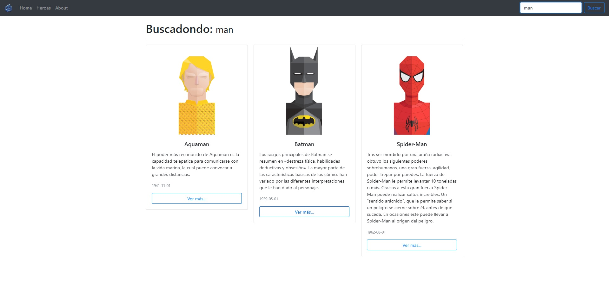

# Heroes App

Creada usando HTML5, CSS3 y JavaScript media el framework Angular.
Pueden descargar el repositorio, utilizando la linea de comando dirigirse a la aplicación y ejecutar el script "npm install".
Luego de que se installen los modulos necesarios de Angular para esta aplicación, ejecutar el script "ng serve" o "ng serve -o"

## Vistas previas de la aplicación
### Heroes
 

### Búsqueda
 

### Personaje
 
